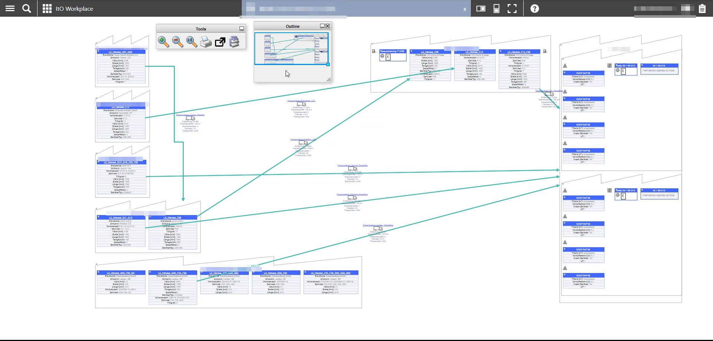
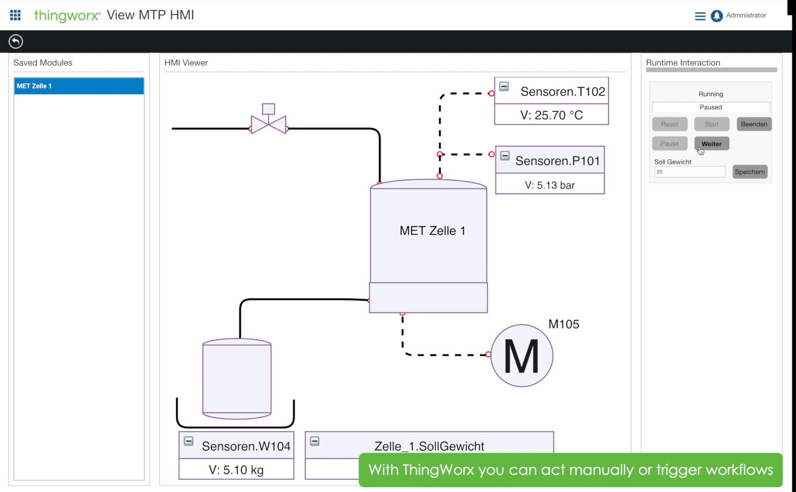

# MxGraphDiagram widget for Thingworx

View diagrams generated with [draw.io](https://draw.io), interact with them and more. It uses the [mxGraph](https://jgraph.github.io/mxgraph/) library.

# Index

- [About](#about)
- [Usage](#usage)
    + [The SVG file](#1-the-svg-file)
    + [The data infotable](#2-the-data-infotable)
      - [Overrides in a nested infotable](#21-overrides-in-a-nested-infotable)
      - [Overrides in a flat infotable](#overrides-in-a-flat-infotable)
      - [Types of overrides](#22-types-of-overrides)
    + [Bindings and properties](#3-bindings-and-properties)
    + [Installation](#4-installation)
- [Development](#development)
- [Resources](#resources)
  * [SVG Demo starter kit](#2-svg-demo-starter-kit)
    + [Installation](#21-installation)
    + [Usage](#22-usage)
- [Gallery](#gallery)
- [Credit/Acknowledgment](#credit-acknowledgment)
- [License](#license)

# About
This is a Thingworx widget allowing visualization of dynamic [draw.io](https://draw.io) diagrams. The diagrams themselves can be exported from draw.io, or, generated dynamically by a service.

# Usage

The main entry point for the widget is the `XMLDiagram` property. This represents a mxGraph XML model.

###  3. Bindings and properties

* `XMLDiagram`: An mxGraph xml containing the diagram. Can be either copied over from draw.io _Extras->Edit Diagram_ menu, or generated using a service.
* `ShowTools,ShowOutline`: Show or hide the helper windows allowing zooming into the diagram, printing it, and more.
* `AutoFit`: Make the graph fit the container when it first loads.
* `CustomShapesXMLPath`: URL that points to a xml shapes file that will be loaded at stratup.
* `EditedCellId`: The id of the cell where the label just changed. Tied to the CellLabelChanged event.
* `EditedCellNewLabel`: The contents of the cell where the label just changed. Tied to the CellLabelChanged event'. 
* `JSONArrayGraphCells`: Override allowing you to do state formatting on the element. It should be an JSON object containing id, value, fillColors and strokeColor.
* `SelectedCellId`: The Id of the currently selected cell.
* `AutoLayout`: The layout algorithm to be applied in the cells in the diagram. By default, no algorithm is selected, meaning that the positions of the cells in the XML are respected. If one algorithm is selected, the graph will be organized acording to that layout.
* `EdgeStyle`: Override the edge style algorithm in the XML. Usually used toghether with `AutoLayout`, allows for generation of good looking edged between cells.

The following events are also available:
* `CellLabelChanged`, `SelectedCellChanged`, `CellDoubleClicked`.

###  4. Installation
- Navigate to the [releases page](/releases)
- Under the latest release, view all the assets
- Download the file `mxdiagram-min-<VERSION>.zip`
- Import the widget into Thingworx

# Development
This projects welcomes contributions. For details about pre-requisites, development environment and file structure, please see stefan-lacatus/ThingworxDemoWebpackWidget. 

##  1. Build

The following commands allow you to build and compile your widget:

* `npm run build`: builds the extension. Creates a new extension zip file under the `zip` folder.
* `npm run watch`: watches the source files, and whenever they change, do a build
* `npm run upload`: creates a build, and uploads the extension zip to the thingworx server configured in `package.json`.

#  Resources

#  Gallery

# Credit/Acknowledgment
Petrisor Lacatus  (@stefan-lacatus)

#  License
[ISC License](LICENSE.MD)
